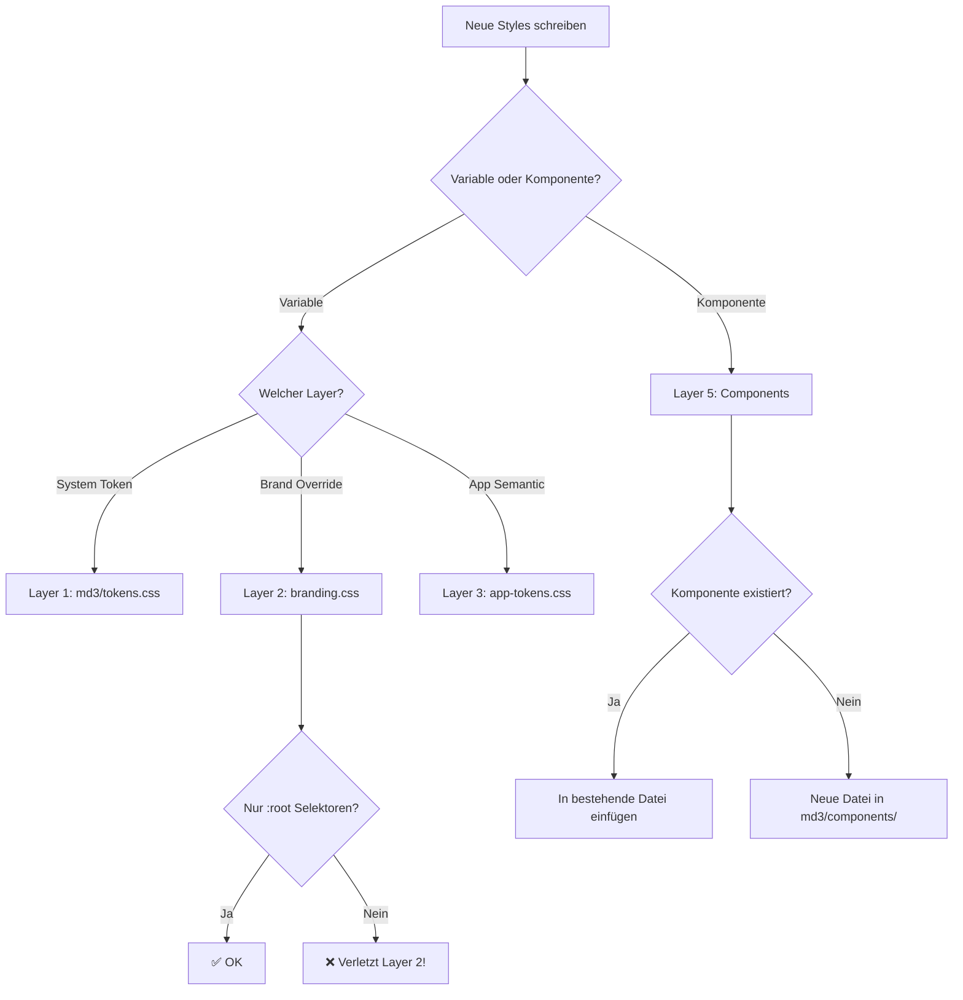

# CSS Architecture – Layer System

**Letzte Aktualisierung:** 2025-12-20  
**Verantwortlich:** hispanistica_games Frontend Team  
**Related:** [background-standard.md](background-standard.md), [css-architecture-audit.md](css-architecture-audit.md)

---

## 📋 Übersicht

Dieses Dokument definiert die **5-Layer CSS-Architektur** für hispanistica_games. Ziel ist eine klare Trennung von Concerns, vorhersehbare Cascade und wartbaren Code.

## 🏗️ Layer-Hierarchie

```
┌─────────────────────────────────────┐
│ Layer 1: System Design Tokens       │ ← md3/tokens.css
├─────────────────────────────────────┤
│ Layer 2: Brand Overrides            │ ← branding.css
├─────────────────────────────────────┤
│ Layer 3: App Semantic Tokens        │ ← app-tokens.css
├─────────────────────────────────────┤
│ Layer 4: Layout & Structure         │ ← layout.css, md3/layout.css
├─────────────────────────────────────┤
│ Layer 5: Components                 │ ← md3/components/*.css
└─────────────────────────────────────┘
```

**Ladereihenfolge in base.html:**

```html
<!-- Layer 1: System Tokens -->
<link rel="stylesheet" href="{{ url_for('static', filename='css/md3/tokens.css') }}">

<!-- Layer 3: App Tokens -->
<link rel="stylesheet" href="{{ url_for('static', filename='css/app-tokens.css') }}">

<!-- Layer 2: Brand Overrides (AFTER app-tokens!) -->
<link rel="stylesheet" href="{{ url_for('static', filename='css/branding.css') }}">

<!-- Layer 4: Layout -->
<link rel="stylesheet" href="{{ url_for('static', filename='css/md3/layout.css') }}">

<!-- Layer 5: Components -->
<link rel="stylesheet" href="{{ url_for('static', filename='css/md3/components/buttons.css') }}">
<link rel="stylesheet" href="{{ url_for('static', filename='css/md3/components/navigation-drawer.css') }}">
<!-- ... alle weiteren Komponenten ... -->
```

---

## 📐 Layer-Regeln

### Layer 1: System Design Tokens (`md3/tokens.css`)

**Zweck:** Material Design 3 Basis-Token (Farben, Typography, Spacing)  
**Erlaubt:**
- `:root { --md-sys-color-*, --md-sys-spacing-*, --md-ref-typeface-* }`
- Theme-spezifische Token: `:root[data-theme="dark"] { ... }`

**Verboten:**
- ❌ Klassen-Selektoren (`.class`)
- ❌ ID-Selektoren (`#id`)
- ❌ Layout-Properties außerhalb von Variablen

**Beispiel:**
```css
:root {
  --md-sys-color-primary: #6750A4;
  --md-sys-spacing-1: 8px;
}

:root[data-theme="dark"] {
  --md-sys-color-primary: #D0BCFF;
}
```

---

### Layer 2: Brand Overrides (`branding.css`)

**Zweck:** Brand-spezifische Anpassungen (hispanistica_games Farben)  
**Erlaubt:**
- `:root { --brand-* }` – Brand-Token-Definitionen
- `:root { --md-sys-* : var(--brand-*) }` – MD3-Token mit Brand-Werten überschreiben
- Theme-Selektoren: `:root[data-theme="dark"]`

**Verboten:**
- ❌ **KEINE Komponenten-Regeln!** (`.md3-*`, `.app-*`, `#*`)
- ❌ Layout-Properties (`width`, `height`, `padding`, `margin`)
- ❌ Direktes Styling von HTML-Elementen

**Beispiel (✅ Korrekt):**
```css
:root {
  --brand-primary: #1e3a5f;
  --brand-accent: #ff6b35;
  
  /* MD3-System-Token mit Brand-Werten überschreiben */
  --md-sys-color-primary: var(--brand-primary);
  --md-sys-color-secondary: var(--brand-accent);
}
```

**Beispiel (❌ FALSCH – Verletzt Layer 2!):**
```css
/* ❌ NIEMALS in branding.css! */
.md3-navigation-drawer__logo {
  width: 180px; /* Gehört in navigation-drawer.css! */
}

.md3-index-brand {
  display: flex; /* Gehört in index.css! */
}
```

---

### Layer 3: App Semantic Tokens (`app-tokens.css`)

**Zweck:** App-spezifische semantische Abstraktionen  
**Erlaubt:**
- `:root { --app-* }` – Semantische App-Token
- Theme-Selektoren: `:root[data-theme="dark"]`

**Verboten:**
- ❌ Komponenten-Regeln
- ❌ Layout außerhalb von Token-Definitionen

**Beispiel:**
```css
:root {
  --app-background: var(--md-sys-color-surface);
  --app-color-success: #4caf50;
  --app-color-error: var(--md-sys-color-error);
}

:root[data-theme="dark"] {
  --app-background: var(--md-sys-color-surface-dim);
}
```

---

### Layer 4: Layout & Structure (`layout.css`, `md3/layout.css`)

**Zweck:** Globale Layout-Strukturen (Grid, Container, Utility-Classes)  
**Erlaubt:**
- Utility-Classes (`.container`, `.flex-row`, `.grid`)
- Globale Layout-Regeln

**Verboten:**
- ❌ Komponenten-spezifische Styles (gehören in Layer 5)

**Beispiel:**
```css
.container {
  max-width: 1200px;
  margin: 0 auto;
}

.flex-row {
  display: flex;
  gap: var(--space-3);
}
```

---

### Layer 5: Components (`md3/components/*.css`)

**Zweck:** Komponenten-spezifische Styles  
**Erlaubt:**
- Komponenten-Klassen (`.md3-button`, `.md3-navigation-drawer`)
- Element-Modifier (`.md3-button--primary`, `.md3-button__icon`)
- Pseudo-Selektoren (`:hover`, `:focus`)

**Beispiel:**
```css
/* md3/components/navigation-drawer.css */
.md3-navigation-drawer__logo {
  width: 180px;
  height: auto;
  padding: var(--space-3) var(--space-4);
  border-radius: var(--radius-md);
  display: block;
}

/* md3/components/index.css */
.md3-index-brand {
  display: flex;
  align-items: center;
  justify-content: center;
  gap: var(--space-3);
}

.md3-index-brand__icon {
  font-size: 48px;
  color: var(--md-sys-color-primary);
}
```

---

## 🛠️ Wohin mit neuen Styles?

### Frage 1: Ist es eine Variable/Token?

**JA** → Layer 1, 2 oder 3

- **System-Token (MD3)?** → `md3/tokens.css` (Layer 1)
- **Brand-Override (Farben)?** → `branding.css` (Layer 2)
- **App-Semantic (--app-*)?** → `app-tokens.css` (Layer 3)

### Frage 2: Ist es eine Komponente?

**JA** → Layer 5 (`md3/components/`)

- **Existiert die Komponente schon?** → Entsprechende `.css` bearbeiten
- **Neue Komponente?** → Neue Datei in `md3/components/` erstellen

**Namenskonvention:**
```
md3/components/
├── buttons.css          (Button-Komponenten)
├── navigation-drawer.css (Nav Drawer)
├── index.css            (Index-spezifisch)
├── cards.css            (Card-Komponenten)
└── [neue-komponente].css
```

### Frage 3: Ist es ein Layout-Utility?

**JA** → Layer 4 (`layout.css` oder `md3/layout.css`)

**Beispiele:**
- Grid-Systeme
- Spacing-Utilities (`.mt-2`, `.mb-4`)
- Container-Klassen

---

## 🔍 Validierung

### Automatisches Linting (CI/CD)

```powershell
# Lokal testen
.\scripts\check-css-architecture.ps1

# In CI/CD Pipeline integrieren
- name: CSS Architecture Lint
  run: pwsh scripts/check-css-architecture.ps1
```

Das Script prüft:

1. ✅ `branding.css` enthält nur `:root` Selektoren
2. ✅ Keine Komponenten-Klassen (`.md3-*`, `.app-*`) in `branding.css`
3. ✅ Keine Layout-Properties außerhalb von Variablen in `branding.css`

### Manuelle Code Review

**Checkliste:**

- [ ] Ist `branding.css` sauber (nur Variablen)?
- [ ] Laden Komponenten-CSS nach Layout?
- [ ] Sind Theme-Selektoren konsistent (`data-theme`, nicht `@media`)?
- [ ] Keine hardcodierten Hex-Werte außerhalb von Token-Dateien?

---

## 🐛 Häufige Fehler

### ❌ Fehler 1: Komponenten-Regel in `branding.css`

**Problem:**
```css
/* branding.css */
.md3-button {  /* ❌ FALSCH! */
  background-color: var(--brand-primary);
}
```

**Lösung:**
```css
/* branding.css */
:root {
  --md-sys-color-primary: var(--brand-primary); /* ✅ Korrekt */
}

/* md3/components/buttons.css */
.md3-button {
  background-color: var(--md-sys-color-primary); /* ✅ Verwendet Token */
}
```

---

### ❌ Fehler 2: Falsche Ladereihenfolge

**Problem:**
```html
<!-- ❌ FALSCH: branding.css lädt vor tokens.css -->
<link rel="stylesheet" href="branding.css">
<link rel="stylesheet" href="md3/tokens.css">
```

**Lösung:**
```html
<!-- ✅ Korrekt: System → App → Brand → Layout → Components -->
<link rel="stylesheet" href="md3/tokens.css">
<link rel="stylesheet" href="app-tokens.css">
<link rel="stylesheet" href="branding.css">
<link rel="stylesheet" href="md3/layout.css">
<link rel="stylesheet" href="md3/components/buttons.css">
```

---

### ❌ Fehler 3: Hardcodierte Werte statt Token

**Problem:**
```css
.my-component {
  color: #1e3a5f; /* ❌ Hardcoded */
}
```

**Lösung:**
```css
.my-component {
  color: var(--md-sys-color-primary); /* ✅ Token verwenden */
}
```

---

## 📚 Weitere Ressourcen

- [background-standard.md](background-standard.md) – Token-Hierarchie im Detail
- [css-architecture-audit.md](css-architecture-audit.md) – Audit-Report vom 2025-12-20
- [MD3 Design Tokens Spec](https://m3.material.io/foundations/design-tokens/overview)

---

## 🔄 Änderungshistorie

| Datum | Änderung |
|-------|----------|
| 2025-12-20 | Initial: CSS-Architektur-Dokumentation erstellt nach Refactor |
| 2025-12-20 | Layer 2 (branding.css) gesäubert – Komponenten-Regeln entfernt |
| 2025-12-20 | Guardrails hinzugefügt: `check-css-architecture.ps1` Script |

---

## ✅ Quick-Check: Ist meine Änderung korrekt?



---

**Bei Fragen:** Siehe [css-architecture-audit.md](css-architecture-audit.md) für Beispiele oder `#frontend` Slack-Channel.
