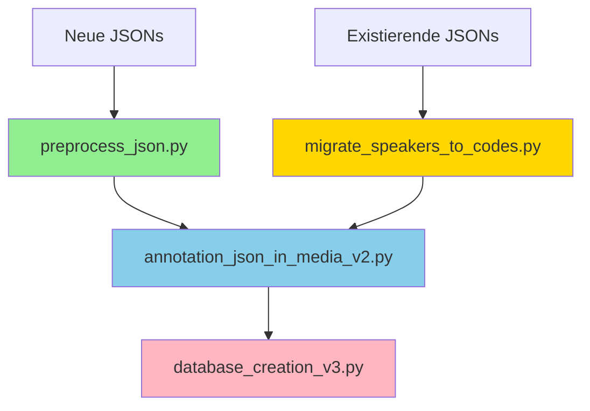

# Database Creation v3 Reference (Legacy)

> **⚠️ ARCHIVED**: This document describes the legacy SQLite-based `transcription.db` creation.
> The application has migrated to **BlackLab-based search**; `transcription.db` no longer exists.
> For current corpus indexing, see the BlackLab pipeline: `scripts/blacklab/run_export.py` → `scripts/build_blacklab_index.ps1`.

Referenzdokumentation für `database_creation_v3.py` - Vereinfachte JSON-basierte Datenbankerstellung.

---

## Überblick

`database_creation_v3.py` erstellt alle SQLite-Datenbanken aus bereits annotierten JSON-Dateien. Version 3 ist eine **vereinfachte** Version, die:

- ❌ **Keine** Token-ID-Generierung mehr durchführt (erfolgt in `annotation_json_in_media_v2.py`)
- ❌ **Keine** `annotation_data.db` mehr erstellt (Annotationen in `transcription.db`)
- ❌ **Keine** `speakers[]` Array-Verarbeitung mehr (entfernt durch Migration)
- ✅ `speaker_code` **direkt** aus Segment liest (standardisiert)
- ✅ `token_id` und `norm` aus JSON liest (Pflichtfelder)
- ✅ Performance-Indizes für schnelle Suchen erstellt

---

## Datenbanken

### 1. `db_public/stats_all.db`

**Zweck:** Globale Statistiken (öffentlich zugänglich)

**Tabelle:** `stats`
```sql
CREATE TABLE stats (
    id INTEGER PRIMARY KEY,
    total_word_count INTEGER,
    total_duration_all TEXT  -- Format: HH:MM:SS
)
```

**Inhalt:** Eine Zeile (id=1) mit:
- Gesamtzahl aller Tokens im Korpus
- Gesamtdauer aller Aufnahmen

**Update:** Wird bei jedem Rebuild überschrieben

---

### 2. `db/stats_country.db`

**Zweck:** Statistiken pro Land

**Tabelle:** `stats_country`
```sql
CREATE TABLE stats_country (
    id INTEGER PRIMARY KEY AUTOINCREMENT,
    country_code TEXT UNIQUE,
    total_word_count INTEGER,
    total_duration_country TEXT  -- Format: HH:MM:SS
)
```

**Inhalt:** Eine Zeile pro Land (z.B. ARG, COL, ESP)
- Wortzahl pro Land
- Gesamtdauer aller Aufnahmen des Landes

**Update:** DROP TABLE + Rebuild bei jedem Lauf

---

### 3. `db/stats_files.db`

**Zweck:** Metadaten pro Datei

**Tabelle:** `metadata`
```sql
CREATE TABLE metadata (
    id INTEGER PRIMARY KEY AUTOINCREMENT,
    filename TEXT UNIQUE,
    country_code TEXT,
    radio TEXT,
    date TEXT,           -- Format: YYYY-MM-DD
    revision TEXT,
    word_count INTEGER,
    duration TEXT        -- Format: HH:MM:SS.ss
)
```

**Inhalt:** Eine Zeile pro JSON-Datei
- Dateiname (eindeutig)
- Land, Radiosender, Datum, Revision
- Wortzahl und Dauer der Datei

**Update:** DROP TABLE + Rebuild

---

### 4. `db/transcription.db` (Hauptdatenbank)

**Zweck:** Alle Tokens für BlackLab-Indexierung

**Tabelle:** `tokens`
```sql
CREATE TABLE tokens (
    id INTEGER PRIMARY KEY AUTOINCREMENT,
    token_id TEXT UNIQUE,         -- Stabile ID aus JSON
    filename TEXT,
    country_code TEXT,
    radio TEXT,
    date TEXT,
    speaker_type TEXT,            -- Abgeleitet aus speaker_code
    sex TEXT,                     -- Abgeleitet aus speaker_code
    mode TEXT,                    -- Abgeleitet aus speaker_code
    discourse TEXT,               -- Abgeleitet aus speaker_code
    text TEXT,                    -- Original-Text
    start REAL,                   -- Start-Zeit (Sekunden)
    end REAL,                     -- End-Zeit (Sekunden)
    context_left TEXT,            -- Linker Kontext (bis zu 10 Tokens)
    context_right TEXT,           -- Rechter Kontext (bis zu 10 Tokens)
    context_start REAL,           -- Kontext-Start (Sekunden)
    context_end REAL,             -- Kontext-Ende (Sekunden)
    norm TEXT,                    -- Normalisierte Suchform (aus JSON)
    lemma TEXT                    -- Lemma (aus JSON)
)
```

**Performance-Indizes:**
```sql
-- Primäre Suchfelder
idx_tokens_text                        -- text-Suche
idx_tokens_norm                        -- Akzent-/case-indifferente Suche
idx_tokens_lemma                       -- Lemma-Suche

-- Filter-Felder
idx_tokens_country                     -- Land-Filter
idx_tokens_speaker                     -- Speaker-Type-Filter
idx_tokens_sex                         -- Geschlechts-Filter
idx_tokens_mode                        -- Modus-Filter (libre/lectura/pre)
idx_tokens_discourse                   -- Diskurs-Filter (general/tiempo/tránsito)
idx_tokens_date                        -- Datums-Filter

-- Composite-Index für häufige Kombinationen
idx_tokens_country_speaker_mode        -- Kombinierter Filter

-- Spezial-Indizes
idx_tokens_filename_id                 -- Für Datei-basierte Suchen
```

**Update:** DROP TABLE + Rebuild + ANALYZE

---

## Speaker-Code Mapping

### Funktion: `map_speaker_attributes(code)`

**Input:** Standardisierter `speaker_code` (z.B. `'lib-pm'`)

**Output:** Tuple `(speaker_type, sex, mode, discourse)`

**Mapping-Tabelle:**

| Code      | speaker_type | sex | mode     | discourse |
|-----------|--------------|-----|----------|-----------|
| lib-pm    | pro          | m   | libre    | general   |
| lib-pf    | pro          | f   | libre    | general   |
| lib-om    | otro         | m   | libre    | general   |
| lib-of    | otro         | f   | libre    | general   |
| lec-pm    | pro          | m   | lectura  | general   |
| lec-pf    | pro          | f   | lectura  | general   |
| lec-om    | otro         | m   | lectura  | general   |
| lec-of    | otro         | f   | lectura  | general   |
| pre-pm    | pro          | m   | pre      | general   |
| pre-pf    | pro          | f   | pre      | general   |
| tie-pm    | pro          | m   | n/a      | tiempo    |
| tie-pf    | pro          | f   | n/a      | tiempo    |
| traf-pm   | pro          | m   | n/a      | tránsito  |
| traf-pf   | pro          | f   | n/a      | tránsito  |
| **foreign** | n/a        | n/a | n/a      | foreign   |
| **none**    | (empty)    | (empty) | (empty) | (empty) |

**Code-Format:** `{role}-{person}{sex}`
- **role:** lib, lec, pre, tie, traf, foreign
- **person:** p (politician), o (other)
- **sex:** m (masculino), f (femenino)

**Fallback:** Unbekannte Codes → `('', '', '', '')`

---

## Workflow

### Voraussetzungen (WICHTIG!)

**Reihenfolge der Skripte:**



**1. Speaker-Standardisierung (einmalig für existierende JSONs):**
```bash
python migrate_speakers_to_codes.py --root media/transcripts
```

**2. Preprocessing (für neue JSONs):**
```bash
cd "LOKAL/01 - Add New Transcriptions/01 preprocess JSON"
python preprocess_json.py
```
→ Enthält Speaker-Standardisierung als Schritt 4

**3. Annotation (für alle JSONs):**
```bash
cd "../02 annotate JSON"
python annotation_json_in_media_v2.py safe
```
→ Generiert `token_id`, `norm`, `utt_start_ms`, `utt_end_ms`

**4. Datenbank-Erstellung:**
```bash
cd "../03 update DB"
python database_creation_v3.py
```

---

## Verwendung

### Standard: Rebuild aller Datenbanken

```bash
python database_creation_v3.py
```

**Ausgabe:**
```
================================================================================
CO.RA.PAN Database Creation v3 - SIMPLIFIED JSON-ONLY
================================================================================
Project Root:    /path/to/CO.RA.PAN-WEB_new
Transcripts:     /path/to/media/transcripts
DB Directory:    /path/to/data/db
================================================================================

1/4 --> Creating stats_all.db
📁 Found 146 JSON files in 8 countries (deterministic order)
📊 Processing files...
✅ Created stats_all.db

2/4 --> Creating stats_country.db
📊 Processing files by country...
✅ Created 8 country entries

3/4 --> Creating stats_files.db
📊 Processing file metadata...
✅ Inserted: 146 files

4/4 --> Creating transcription.db (SIMPLIFIED - JSON-ONLY)
ℹ️  Token-IDs und norm werden aus JSON gelesen
⚠️  ABBRUCH wenn token_id fehlt → Führe annotation_json_in_media_v2.py zuerst aus
================================================================================

🏗️  Phase 1: Creating database and streaming tokens...
  Processing files and inserting tokens...
  [1/146] ARG/2023-08-10_ARG_Mitre.json (3,421 tokens)
  [2/146] ARG/2023-08-12_ARG_Mitre.json (2,156 tokens)
  ...

✅ Inserted 456,789 tokens into transcription.db

🔨 Creating performance indexes...
  Creating idx_tokens_text...
  Creating idx_tokens_norm...
  ...
✅ Created 11 indexes in 12.34s

📊 Running ANALYZE for query optimizer...
✅ ANALYZE completed in 3.21s

================================================================================
✅ Transcription database creation complete!
================================================================================

⏱️  Total time: 45.67s
```

---

### Verify-Only: Prüfung ohne Rebuild

```bash
python database_creation_v3.py --verify-only
```

**Prüft:**
- ✅ Existenz der Datenbank
- ✅ Vorhandensein aller Indizes
- ✅ `norm`-Spalte im Schema
- ✅ Stichprobe: Token-IDs aus DB vs. JSON

**Ausgabe:**
```
🔍 VERIFY-ONLY MODE
================================================================================

🔍 VERIFYING DATABASE INDEXES
================================================================================

📋 Index Check:
  ✅ idx_tokens_text
  ✅ idx_tokens_norm
  ✅ idx_tokens_lemma
  ...

📋 Schema Check:
  ✅ norm column exists

--------------------------------------------------------------------------------
Found:   11/11 indexes
Missing: 0/11 indexes

🔬 Sample Verification (5 random tokens):
  ✅ ARG123456789ab: "hola" (norm: hola, lemma: hola) - MATCH
  ✅ COL987654321cd: "está" (norm: esta, lemma: estar) - MATCH
  ...

--------------------------------------------------------------------------------
✅ All verifications passed!
```

---

## Fehlerbehandlung

### Problem: Fehlende token_id

**Symptom:**
```
❌ FEHLER: 42 Tokens ohne token_id gefunden!

Beispiele (erste 10):
  - ARG/2023-08-10_ARG_Mitre.json: Segment 0, Token 5: "hola"
  - ARG/2023-08-10_ARG_Mitre.json: Segment 1, Token 12: "mundo"
  ...

⚠️  LÖSUNG: Führe zuerst annotation_json_in_media_v2.py aus:
   cd "LOKAL/01 - Add New Transcriptions/02 annotate JSON"
   python annotation_json_in_media_v2.py safe

ABBRUCH
```

**Lösung:**
```bash
cd "LOKAL/01 - Add New Transcriptions/02 annotate JSON"
python annotation_json_in_media_v2.py safe
```

---

### Problem: Fehlende speaker_code

**Symptom:** Tokens haben leere Speaker-Attribute (`speaker_type='', sex='', mode='', discourse=''`)

**Ursache:** JSON enthält noch `speakers[]` Array + `segment.speaker` statt `segment.speaker_code`

**Lösung:**

1. **Für existierende JSONs:**
```bash
cd "LOKAL/01 - Add New Transcriptions"
python migrate_speakers_to_codes.py --root ../../media/transcripts
```

2. **Für neue JSONs:**
```bash
cd "01 preprocess JSON"
python preprocess_json.py
```

---

### Problem: Unbekannte speaker_code

**Symptom:** Warnings in Console:
```
⚠️  Unbekannter speaker_code gefunden: 'rev'
   Verwende Fallback: ('', '', '', '')
```

**Ursache:** Code nicht in `ALLOWED_CODES` (z.B. nach Migration auf `'none'` gesetzt)

**Lösung:**

1. Prüfe, ob Code valide sein sollte:
   - Ja → Füge zu `ALLOWED_CODES` in `preprocess_json.py` hinzu und migriere erneut
   - Nein → Ignoriere (Fallback-Mapping ist korrekt)

2. Erweitere Mapping in `database_creation_v3.py`:
```python
mapping = {
    ...
    'rev': ('reviewer', 'n/a', 'n/a', 'review'),  # Beispiel
}
```

---

## Optimierungen

### Performance-Merkmale

**1. Streaming Architecture:**
- ✅ Keine globale Token-Sammlung mehr
- ✅ Direkte Insertion während JSON-Parsing
- ✅ Niedriger Memory-Footprint (~100 MB für 500k Tokens)

**2. SQLite-Optimierungen:**
```python
PRAGMA cache_size = -64000;      # 64 MB Cache
PRAGMA temp_store = MEMORY;      # Temp-Tables in RAM
PRAGMA journal_mode = WAL;       # Write-Ahead Logging
PRAGMA synchronous = NORMAL;     # Balance Speed/Safety
```

**3. Index-Strategie:**
- Single-Column-Indizes für häufige Filter
- Composite-Index für typische Kombinationen (country + speaker + mode)
- Filename-basierter Index für Datei-Suchen
- `ANALYZE` nach Rebuild für Query-Optimizer

**4. Deterministische Verarbeitung:**
- Dateien alphabetisch sortiert (per Land → Dateiname)
- Konsistente Reihenfolge für reproduzierbare IDs (wichtig für v2-Kompatibilität)

---

## Datei-Struktur

```
LOKAL/01 - Add New Transcriptions/
└── 03 update DB/
    ├── database_creation_v3.py    # Dieses Skript
    └── README.md                   # (optional) Benutzer-Dokumentation

data/
├── db/
│   ├── transcription.db           # Hauptdatenbank (alle Tokens)
│   ├── stats_country.db           # Land-Statistiken
│   └── stats_files.db             # Datei-Metadaten
└── db_public/
    └── stats_all.db               # Globale Statistiken (öffentlich)
```

---

## Migration von v2 zu v3

### Hauptunterschiede

| Feature | v2 | v3 |
|---------|----|----|
| Token-ID-Generierung | ✅ Im DB-Script | ❌ In `annotation_json_in_media_v2.py` |
| annotation_data.db | ✅ Separate DB | ❌ Entfernt |
| speakers[] Array | ✅ Verarbeitet | ❌ Erwartet `speaker_code` |
| speaker Mapping | Via `spkid` → `speakers[].name` | Direkt aus `segment.speaker_code` |
| norm-Feld | ❌ Nicht vorhanden | ✅ Aus JSON gelesen |
| Streaming | ❌ Globale Token-Liste | ✅ Direktes Streaming |

### Upgrade-Pfad

1. **Backup existierender Datenbanken**
2. **Speaker-Migration durchführen:**
   ```bash
   python migrate_speakers_to_codes.py --root media/transcripts
   ```
3. **Annotation aktualisieren:**
   ```bash
   python annotation_json_in_media_v2.py safe
   ```
4. **Datenbanken neu erstellen:**
   ```bash
   python database_creation_v3.py
   ```

---

## Testing

### Unit-Test-Kandidaten

```python
# test_map_speaker_attributes.py
def test_standard_codes():
    assert map_speaker_attributes('lib-pm') == ('pro', 'm', 'libre', 'general')
    assert map_speaker_attributes('foreign') == ('n/a', 'n/a', 'n/a', 'foreign')
    assert map_speaker_attributes('none') == ('', '', '', '')

def test_unknown_code():
    assert map_speaker_attributes('invalid') == ('', '', '', '')

# test_normalize_token_fallback.py
def test_accent_removal():
    assert normalize_token_fallback('está') == 'esta'
    assert normalize_token_fallback('año') == 'año'  # ñ bleibt

def test_punctuation_stripping():
    assert normalize_token_fallback('¡Hola!') == 'hola'
```

---

## Siehe auch

- [Speaker Code Standardization Migration](../migration/speaker-code-standardization.md) - Migration-Details
- [Database Schema](database-schema.md) - Vollständiges Schema aller Datenbanken
- [Add New Transcriptions](../how-to/add-new-transcriptions.md) - Kompletter Workflow
- [Annotation v2 Reference](annotation-v2-reference.md) - Annotation-Pipeline
